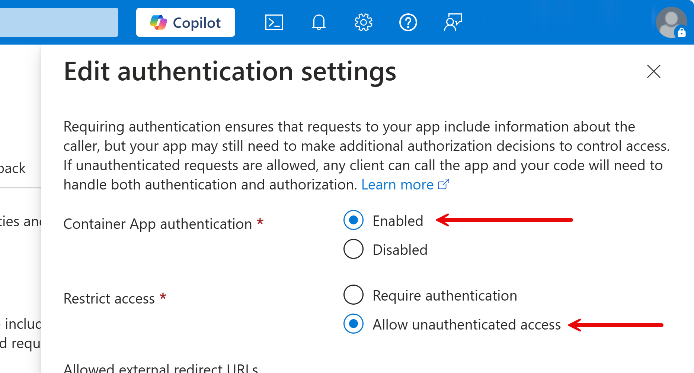
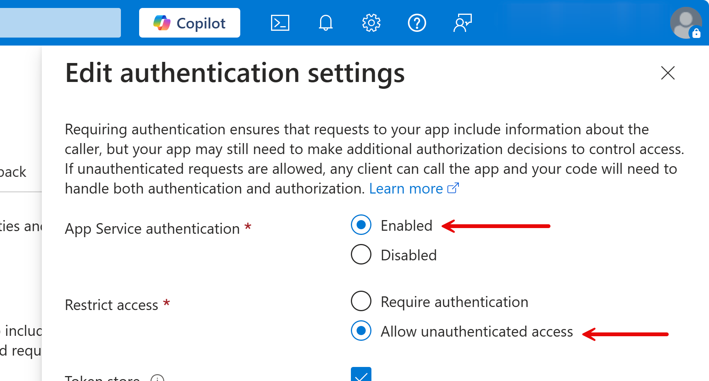

# Azure EasyAuth Extensions

| Package                                                                                                                   | Version | Downloads |
| ------------------------------------------------------------------------------------------------------------------------- | ------- | --------- |
| [Aliencube.Azure.Extensions.EasyAuth](https://www.nuget.org/packages/Aliencube.Azure.Extensions.EasyAuth)                 | [](https://www.nuget.org/packages/Aliencube.Azure.Extensions.EasyAuth) | [](https://www.nuget.org/packages/Aliencube.Azure.Extensions.EasyAuth) |
| [Aliencube.Azure.Extensions.EasyAuth.EntraID](https://www.nuget.org/packages/Aliencube.Azure.Extensions.EasyAuth.EntraID) | [](https://www.nuget.org/packages/Aliencube.Azure.Extensions.EasyAuth.EntraID) | [](https://www.nuget.org/packages/Aliencube.Azure.Extensions.EasyAuth.EntraID) |

Azure services like [Azure App Service](https://learn.microsoft.com/azure/app-service/overview), [Azure Functions](https://learn.microsoft.com/azure/azure-functions/functions-overview), [Azure Container Apps](https://learn.microsoft.com/azure/container-apps/overview) and [Azure Static Web Apps](https://learn.microsoft.com/azure/static-web-apps/overview) offer a built-in authentication service called EasyAuth.

While EasyAuth significantly reduces the time for implementing authentication, because it protects the entire application, you can't protect only specific pages or components.

To give granular controls over individual pages or components, there have been attempts to figure out this issue from developer communities, and here are some resources:

- [EasyAuth for App Service](https://github.com/MaximRouiller/MaximeRouiller.Azure.AppService.EasyAuth) by [Maxime Rouiller](https://github.com/MaximRouiller)
- [EasyAuth for Azure Container Apps](https://johnnyreilly.com/azure-container-apps-easy-auth-and-dotnet-authentication) by [John Reilly](https://bsky.app/profile/johnnyreilly.com)
- [EasyAuth for Azure Static Web Apps](https://github.com/anthonychu/blazor-auth-static-web-apps) by [Anthony Chu](https://bsky.app/profile/anthonychu.ca)

They are still mostly valid, but need to be updated to use the latest .NET features.

By focusing on two services &ndash; Azure App Service and Azure Container Apps, this repository gives several libraries that are easily integrated with your existing ASP.NET Core applications, leverage the Azure EasyAuth features and give fine controls to each page and component.

## Prerequisites

- [.NET 9 SDK or later](https://dotnet.microsoft.com/download/dotnet/9.0)
- [Visual Studio 2022](https://visualstudio.microsoft.com/vs/) or [Visual Studio Code](https://code.visualstudio.com/) with [C# Dev Kit](https://marketplace.visualstudio.com/items?itemName=ms-dotnettools.csdevkit)
- [Azure CLI](https://learn.microsoft.com/cli/azure/install-azure-cli) with [Bicep extension](https://learn.microsoft.com/azure/azure-resource-manager/bicep/install#azure-cli)
- [Azure Devloper CLI](https://learn.microsoft.com/azure/developer/azure-developer-cli/install-azd)
- [GitHub CLI](https://cli.github.com/)
- [Docker Desktop](https://docs.docker.com/get-started/introduction/get-docker-desktop/)
- For Windows users, [PowerShell 7 or later](https://learn.microsoft.com/powershell/scripting/install/installing-powershell)

## Getting Started

### Deploying Sample Apps to Azure App Service and Azure Container Apps

1. Fork this repository to your GitHub account and clone this repository to your local machine.

    ```bash
    gh repo fork aliencube/azure-easyauth-extensions --clone
    ```

   > **NOTE**: You must be logged in to GitHub beforehand. If not, use the command, `gh auth login`.

1. Get into the cloned repository.

    ```bash
    cd azure-easyauth-extensions
    ```

1. Login to Azure.
    
    ```bash
    # Login to Azure via az CLI
    az login
    ```

    ```bash
    # Login to Azure via azd CLI
    azd auth login
    ```

1. Make sure your az CLI and Bicep CLI are up-to-date.

    ```bash
    # az CLI
    az upgrade --allow-preview true
    ```
    
    ```bash
    # az bicep CLI
    az bicep upgrade
    ```

   > **NOTE**: If you see an error while upgrading Bicep CLI, install it first with the command, `az bicep install`.

1. Deploy sample apps through azd CLI.

    ```bash
    azd up
    ```

   > **NOTE 1**: You will be asked to provide Azure subscription and location.

   > **NOTE 2**: You might be facing an error like `app-registration.bicep(1,11) : Error BCP400: Fetching types from the registry requires enabling EXPERIMENTAL feature "ExtensionRegistry".`. If you see this error, set up an environment variable like:
   > 
   >  ```bash
   >  # Bazh/Zsh
   >  export AZD_BICEP_TOOL_PATH="~/.azure/bin/bicep"
   >  ```
   >  
   >  ```powershell
   >  # PowerShell
   >  $env:AZD_BICEP_TOOL_PATH = "~/.azure/bin/bicep.exe"
   >  ```

1. Once deployed, visit both web apps hosted on Azure App Service and Azure Container Apps. Then, navigate to the `/weather` page, and you'll see the `401 Unauthorized` error.
1. Navigate back to the home page and click the "Login" button at the top. Once you sign-in, navigate to the `/weather` page again and see the content.

1. Clean up all resources.

    ```bash
    azd down --force --purge
    ```

### Integrating with Existing ASP.NET Core Apps

[Blazor](https://learn.microsoft.com/aspnet/core/blazor/) is used for explanation, but you can apply it to your ASP.NET Core web app as well.

1. Add a NuGet package to your Blazor web app project. You can add one or more NuGet package libraries depending on your requirements.

    ```bash
    # For Entra ID
    dotnet add package Aliencube.Azure.Extensions.EasyAuth.EntraID
    ```

1. Open `Program.cs` of your Blazor app, find the line, `var app = builder.Build();`, and add the following lines just above the line:

    ```csharp
    // 👇👇👇 Add EasyAuth handler with Entra ID below.
    builder.Services.AddAuthentication(EasyAuthAuthenticationScheme.Name)
                    .AddAzureEasyAuthHandler<EntraIDEasyAuthAuthenticationHandler>();
    builder.Services.AddAuthorization();
    // 👆👆👆 Add EasyAuth handler with Entra ID above.
    
    var app = builder.Build();
    ```

1. In the same `Program.cs` of your Blazor app, find the line, `app.Run();`, and add the following lines just above the line:

    ```csharp
    // 👇👇👇 Add authentication/authorization below.
    app.UseAuthentication();
    app.UseAuthorization();
    // 👆👆👆 Add authentication/authorization above.
    
    app.Run();
    ```

1. Open any Razor page component and add the following lines:

    ```razor
    @page "/random-page-url"
    
    @* 👇👇👇 Add the lines below *@
    @using Aliencube.Azure.Extensions.EasyAuth
    @using Microsoft.AspNetCore.Authorization
    @attribute [Authorize(AuthenticationSchemes = EasyAuthAuthenticationScheme.Name)]
    @* 👆👆👆 Add the lines above *@
    ```

1. Use Azure Portal, and make sure that you have enabled the EasyAuth feature and allow unauthenticated access.

   
   

1. Alternatively, use Bicep to enable the EasyAuth feature and allow unauthenticated access.

    ```bicep
    // For Azure Container Apps
    resource containerappAuthConfig 'Microsoft.App/containerApps/authConfigs@2024-10-02-preview' = {
      name: 'current'
      parent: containerapp
      properties: {
        globalValidation: {
          requireAuthentication: true
          unauthenticatedClientAction: 'AllowAnonymous'
        }
      }
    }
    ```

    ```bicep
    // For Azure App Service
    resource appServiceAuthConfig 'Microsoft.Web/sites/config@2022-03-01' = {
      name: 'authsettingsV2'
      parent: appService
      properties: {
        globalValidation: {
          requireAuthentication: true
          unauthenticatedClientAction: 'AllowAnonymous'
        }
      }
    }
    ```

1. Deploy the app to either Azure App Service or Azure Container Apps, navigate to the page that you enabled authorization and see the `401 Unauthorized` error.
1. Sign-in the web app, navigate to the page again and see no error.

## Out-of-Scope

This repository currently doesn't support:

- EasyAuth for Azure Static Web Apps

## TO-DO List

- [x] Publish NuGet packages
- [x] Implementation for Entra ID
- [ ] Implementation for GitHub
- [ ] Implementation for OpenID Connect
- [ ] Implementation for Google
- [ ] Implementation for Facebook
- [ ] Implementation for X
- [ ] Implementation for Apple
